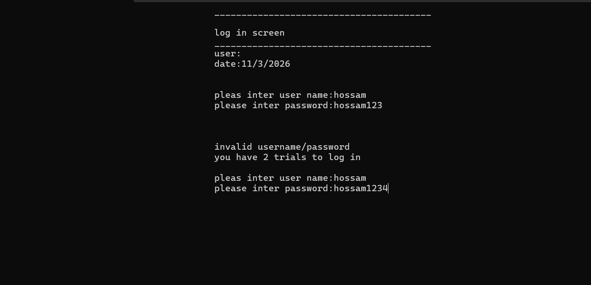
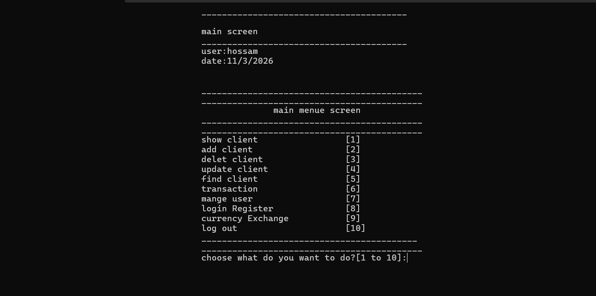
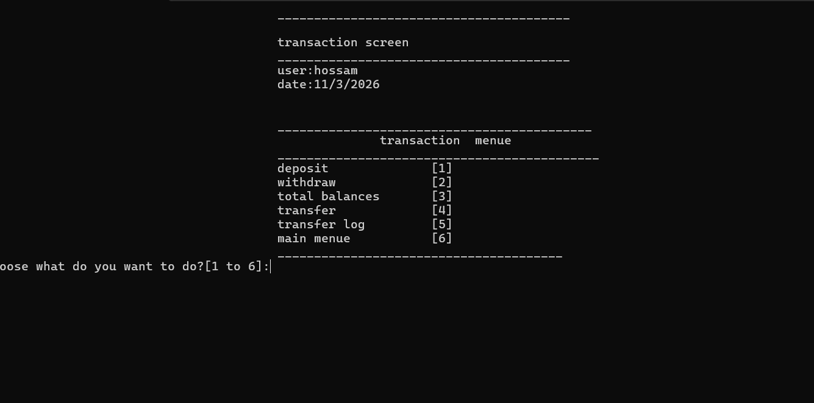

# 🏦 Bank Management System (C++)


A **Console Bank Management System** developed using **C++ and Object-Oriented Programming (OOP)**.

The project simulates a simple banking environment where administrators can manage clients, perform financial transactions, manage system users, and track system activity logs.

---

# 🚀 Features

### Client Management

* Add new clients
* Update client information
* Delete clients
* Find clients
* List all clients

### Transactions

* Deposit money
* Withdraw money
* Transfer money between clients
* Calculate total bank balances

### User Management

* Add new users
* Update users
* Delete users
* Permission-based access control

### Logs

* Login register history
* Transfer log history

### Currency Exchange

* Currency conversion system

---

# 🏗️ Project Architecture

The system is designed using a **layered architecture**.

```
Bank Management System
│
├── UI Layer (Screens)
├── Business Logic Layer
├── Utility Classes
└── Data Storage (Text Files)
```

---

# 🏗️ System Architecture Diagram

```
User
 │
 ▼
UI Screens
(clsScreen and derived classes)
 │
 ▼
Business Logic
(clsBankClient, clsUser, clsPerson)
 │
 ▼
Utility Classes
(clsString, clsDate, clsUtil, clsInputValidate)
 │
 ▼
Data Storage
(Text Files)
```

---

# 🧠 Business Logic Classes

## clsPerson

Base class representing general person information.

```
FirstName
LastName
Email
Phone
```

---

## clsBankClient

Represents a bank client.

Main operations:

* Find client
* Add client
* Update client
* Delete client
* Deposit
* Withdraw
* Transfer
* Get total balances

---

## clsUser

Represents a system user.

Responsibilities:

* Login authentication
* Permission control
* User management
* Login activity logging

---

# 🔐 Permission System

The system uses **bitmask permissions** to control access.

Example permissions:

```
Show Client List
Add Client
Delete Client
Update Client
Find Client
Transactions
Manage Users
Login Register
```

Each user may have different access rights.

---

# 🛠 Utility Classes

Helper classes used across the system.

```
clsString
clsDate
clsUtil
clsInputValidate
```

Examples:

* String splitting
* Date formatting
* Input validation
* Random generation

---

# 💾 Data Storage

The system uses **text files as a simple database**.

Files used:

```
Clients.txt
Users.txt
TransferLog.txt
LoginRegister.txt
```

---

## Clients File Format

```
FirstName#//#LastName#//#Email#//#Phone#//#AccountNumber#//#PinCode#//#Balance
```

Example:

```
Ali#//#Hassan#//#ali@mail.com#//#012345#//#A100#//#1234#//#5000
```

---

# 📁 Project Structure

```
BankManagementSystem
│
├── Screens
│   ├── clsScreen.h
│   ├── clsMainScreen.h
│   ├── clsShowLoginScreen.h
│
├── Core Classes
│   ├── clsPerson.h
│   ├── clsBankClient.h
│   ├── clsUser.h
│
├── Utilities
│   ├── clsString.h
│   ├── clsDate.h
│   ├── clsUtil.h
│   ├── clsInputValidate.h
│
├── Data Files
│   ├── Clients.txt
│   ├── Users.txt
│   ├── TransferLog.txt
│   ├── LoginRegister.txt
│
└── main.cpp
```

---

# 📸 System Screenshots

### Login Screen



---

### Main Menu



---

### Client List


---

### Transactions



---

# 🧰 Technologies Used

```
C++
Object-Oriented Programming (OOP)
File Handling
STL (vector, string)
Console Application
```

---

# 👨‍💻 Author

**Hossam El-Side Salim Gholam**

Computer Science Student
Backend Development Path (.NET)

---

⭐ If you find this project useful, feel free to star the repository.
