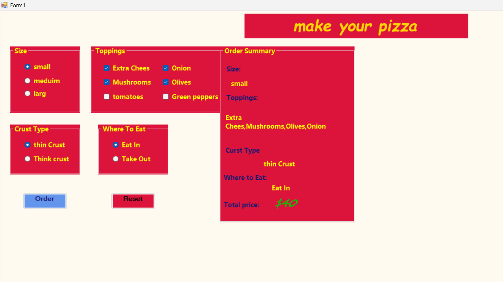
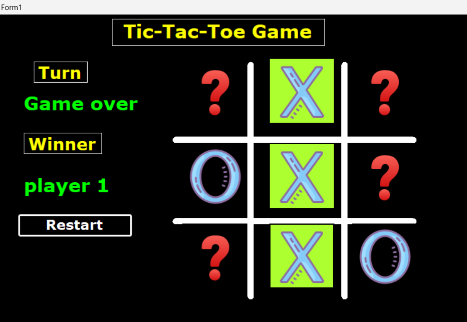

# 📘 C# – Level 1

### The Beginning of Stage Two

---

## 🗝️ About This Course

This is the **fourteenth course** in my programming journey, and the start of **Stage Two**.

After completing Stage One, I already built:

- Strong problem-solving skills  
- Clean coding and OOP understanding  
- Ability to build and extend real applications  
- Solid understanding of data structures and performance  

Stage One is complete.

Now the focus shifts to something deeper.

---

## 🎯 Purpose

This course is not just about learning C#.

It is about building **universal programming foundations** that apply to any field.

This stage prepares me for:

- Backend development  
- Databases  
- Real-world systems  

---

## 🔐 Why C# & Desktop?

The choice is intentional:

**C#**
- Professional, widely used language  
- Used in backend, enterprise, and cloud systems  

**Desktop**
- Less distraction from UI complexity  
- More focus on logic and structure  

🧠 Desktop is a training ground — not the goal.  

---

## 🧠 What I Learned

- .NET fundamentals (CLR, JIT, GC…)  
- C# syntax and clean coding practices  
- Data types, structures, and exceptions  
- Control flow and arrays  
- Basics of LINQ  
- Building desktop apps using Windows Forms  
- Working with events and UI structure  

---

## 🏗️ Practice

Built real applications like:
- [Pizza App](Practice/pizza-project)

  

- [Tic-Tac-Toe](Practice/tic-tac-to)

  

## 🖼️ Practice Preview

---

## 🎓 Outcome

After this course, I can:

- Write structured C# code  
- Understand how .NET works  
- Build desktop applications  
- Prepare for backend and database learning  

---

## 🚀 Stage Two

This course starts a more important stage.

It focuses on:

- Backend thinking  
- Databases  
- Real-world systems  

---

## 🧠 Final Thought

Strong developers don’t rush tools.

They build foundations first.